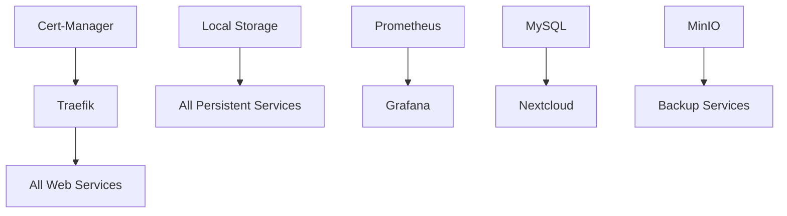

# 📋 Services Documentation

## Core Services Overview

### 🗄️ Storage Services

#### MinIO Object Storage
- **Purpose**: S3-compatible object storage for backups and application data
- **Access**: Internal cluster service
- **Storage**: 100Gi by default
- **Features**:
  - High availability storage
  - Backup target for applications
  - Compatible with AWS S3 APIs
  - Web console for management

#### Local Path Provisioner
- **Purpose**: Dynamic persistent volume provisioning
- **Type**: Default storage class
- **Location**: Host filesystem under `/var/lib/rancher/k3s/storage`
- **Features**:
  - Automatic volume creation
  - Host-local storage
  - Simple and fast

---

### 🌐 Networking & Ingress

#### Traefik Ingress Controller
- **Purpose**: Reverse proxy and load balancer
- **Features**:
  - Automatic service discovery
  - SSL/TLS termination
  - Let's Encrypt integration
  - Dashboard at port 8080
- **Configuration**: Annotations on Ingress resources

#### Cert-Manager
- **Purpose**: Automatic SSL certificate management
- **Provider**: Let's Encrypt
- **Features**:
  - Automatic certificate issuance
  - Certificate renewal
  - DNS-01 and HTTP-01 challenges
  - Certificate monitoring

---

### 📊 Monitoring Stack

#### Prometheus
- **Purpose**: Metrics collection and storage
- **Storage**: 50Gi retention for 30 days
- **Targets**:
  - Kubernetes cluster metrics
  - Node metrics via node-exporter
  - Application metrics (custom)
- **Access**: Internal cluster service

#### Grafana
- **Purpose**: Metrics visualization and alerting
- **URL**: https://grafana.homelab.local
- **Features**:
  - Pre-configured Prometheus datasource
  - Kubernetes dashboards
  - Custom alerting rules
  - User management

#### Uptime Kuma
- **Purpose**: Service uptime monitoring
- **URL**: https://uptime.homelab.local
- **Features**:
  - HTTP/HTTPS monitoring
  - Status page creation
  - Multiple notification channels
  - Incident management

---

### 🛠️ Applications

#### Nextcloud
- **Purpose**: File sync, sharing, and collaboration
- **URL**: https://nextcloud.homelab.local
- **Storage**: 100Gi for user data
- **Database**: MySQL 8.0 (20Gi)
- **Features**:
  - File synchronization
  - Calendar and contacts
  - Office document editing
  - App ecosystem
  - External storage support

#### Vaultwarden
- **Purpose**: Password manager (Bitwarden server)
- **URL**: https://vault.homelab.local
- **Admin**: https://vault.homelab.local/admin
- **Features**:
  - Bitwarden-compatible API
  - Web vault access
  - Mobile app support
  - Organization features
  - Secure note storage

#### Jellyfin
- **Purpose**: Media server for video streaming
- **URL**: https://jellyfin.homelab.local
- **Media Path**: `/mnt/media` (configure as needed)
- **Features**:
  - Video transcoding
  - Multi-device streaming
  - User management
  - Plugin ecosystem
  - DLNA support

#### Heimdall
- **Purpose**: Application dashboard
- **URL**: https://dashboard.homelab.local
- **Features**:
  - Service bookmarks
  - Application tiles
  - Search integration
  - Theme customization
  - Widget support

---

### 🔄 GitOps

#### ArgoCD
- **Purpose**: GitOps continuous delivery
- **URL**: https://argocd.homelab.local
- **Features**:
  - Git repository synchronization
  - Application lifecycle management
  - Multi-cluster support
  - Rollback capabilities
  - Automated deployments

---

## Service Dependencies



## Resource Requirements

| Service | CPU Request | Memory Request | Storage |
|---------|-------------|----------------|---------|
| Traefik | 100m | 128Mi | 1Gi |
| Nextcloud | 200m | 512Mi | 100Gi |
| MySQL | 100m | 256Mi | 20Gi |
| Vaultwarden | 50m | 128Mi | 5Gi |
| Jellyfin | 200m | 512Mi | Variable |
| Grafana | 100m | 256Mi | 10Gi |
| Prometheus | 200m | 512Mi | 50Gi |
| Heimdall | 50m | 128Mi | 1Gi |
| Uptime Kuma | 50m | 128Mi | 5Gi |
| ArgoCD | 250m | 512Mi | 10Gi |

**Total Minimum**: 1.15 CPU cores, 3Gi RAM, ~200Gi storage

## Service Configuration

### Environment Variables
Services are configured via:
- Kubernetes ConfigMaps
- Environment variables in deployments
- Persistent volume mounts
- Secrets for sensitive data

### Customization
To modify service configurations:
1. Edit the deployment YAML files
2. Update ConfigMaps as needed
3. Apply changes: `kubectl apply -f <file>`
4. Restart services if required

### Scaling
Scale services with:
```bash
kubectl scale deployment <service-name> --replicas=<count> -n <namespace>
```

**Note**: Some services (databases) should not be scaled beyond 1 replica without proper clustering.

## Networking

### Service Discovery
- Services communicate via Kubernetes DNS
- Format: `<service-name>.<namespace>.svc.cluster.local`
- Internal traffic only (ClusterIP services)

### External Access
- All external access via Traefik ingress
- HTTPS termination at ingress level
- DNS resolution via hosts file or local DNS server

### Ports
| Service | Internal Port | External Access |
|---------|---------------|-----------------|
| Traefik Dashboard | 8080 | Host IP:8080 |
| All Web Services | 80/443 | Via ingress |
| Kubernetes API | 6443 | Host IP:6443 |

## Backup Strategy

### What's Backed Up:
- **Application Data**: Persistent volumes
- **Configuration**: Kubernetes manifests and configs
- **Databases**: SQL dumps and data directories
- **Certificates**: Let's Encrypt certificates

### Backup Schedule:
- **Daily**: Application data (2 AM)
- **Weekly**: Full system backup (Sunday 3 AM)
- **Monthly**: Long-term archive

### Retention:
- Daily: 7 days
- Weekly: 4 weeks
- Monthly: 12 months

## Monitoring & Alerts

### Default Dashboards:
- Kubernetes cluster overview
- Node resource utilization
- Application performance metrics
- Service uptime status

### Alert Rules:
- High CPU/memory usage
- Service downtime
- Storage space warnings
- Certificate expiration
- Failed backup notifications

### Notification Channels:
Configure in Grafana:
- Email notifications
- Slack integration
- Discord webhooks
- Custom webhooks

## Security

### Network Security:
- All traffic encrypted in transit
- Internal service communication
- Firewall rules (UFW)
- No direct container access from internet

### Authentication:
- Individual service authentication
- Kubernetes RBAC
- SSL certificate validation
- Optional: Authelia for SSO

### Data Security:
- Encrypted persistent volumes (optional)
- Secure secrets management
- Regular security updates
- Backup encryption

---

## Adding New Services

To add a new service:

1. Create namespace:
   ```bash
   kubectl create namespace <service-name>
   ```

2. Create deployment and service YAML
3. Add ingress for external access
4. Update monitoring (ServiceMonitor)
5. Configure backup (if needed)
6. Update documentation

Example structure:
```
kubernetes/services/<service-name>/
├── namespace.yaml
├── deployment.yaml
├── service.yaml
├── ingress.yaml
└── configmap.yaml
```

For more detailed setup instructions, see the main [README.md](../README.md).